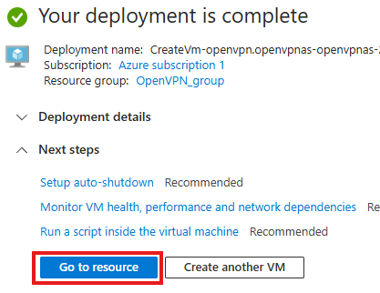

# OpenVPN Server on Azure

Before starting, ensure you have the following:
- An **Azure account** with the ability to create virtual machines.
- OpenVPN client software installed on your devices.


## Steps

## 1. Create an Azure Virtual Machine
- Log in to the Azure portal and navigate to **Create a resource**.
  

- Under **Virtual Machines**, click **Create**  

  

- Name your **Virtual Machine**

  

- Select the region you would like your server to be located

  

- Select **'See all images'** and search for **'openvpn'** then select **'OpenVPN Access Server - x64 Gen 1'**

  
  

> [!IMPORTANT]
> Make sure your security type is set to **'Standard'** as OpenVPN is not compatible with Trusted Launch VM because this feature uses enhanced security measures, such as secure boot and vTPM, which may conflict with the OpenVPN setup process.
  

- Select **Standard_B1s** as it is part of Azure's free tier and provides sufficient resources for running an OpenVPN server.

  

- Select **'Password'** as the authentication type and enter the credentials you want to use; these will be required to SSH into your server later.

  

- Click **'Review + Create'**, wait for the validation process to complete, and allow sufficient time for your virtual machine to start up after deployment.

  
  
  

- Once the deployment is complete, click **'Go to Resource'** and use the **'Connect'** option to access your instance.
  
  
  

- This will display your server's IP address and the admin username, which you will use to SSH into your server.
  
  

## 2. SSH into your Virtual Machine

- Use these credentials to SSH into your server.

```bash 
ssh <admin-username>@<public-ip-address>
```

  

- Enter the password you set earlier during the VM setup for authentication.
  
  

- After entering your password, a configuration agreement script will run; simply follow the prompts and agree to the terms.
  
  

- Leave the rest of the prompts at their default settings by pressing Enter until you reach the prompt where OpenVPN allows you to change the username for the admin dashboard. You can either change it to a username of your choice or leave it as the default by pressing Enter.
  
  

- The same applies to the password: you can set a custom password or leave it empty to have one randomly generated.
  
  

- You don’t need to modify anything else, so leave everything else to default until you see the message Initial Configuration Complete!.
  
  

## 3. Configure OpenVPN admin panel

- You can now access the OpenVPN admin dashboard by navigating to your web browser and entering:

  ```
  your-ip-address/admin
  ```
  
  

- Click Show **'Advanced'** and then select **'Proceed'** to continue to the OpenVPN admin dashboard.
  
  

- Now enter the admin credentials you configured earlier during the SSH setup to log into the OpenVPN admin dashboard.
  
  

- Navigate to **'Network Settings'**.
  
  

- Replace the default hostname or IP address with your Azure server's public IP.
  
  

  

- Save your settings by clicking **'Save'** at the bottom of the page, then click **'Update Running Server'** to apply the changes. This will cause the server to restart and log you out of the dashboard. Simply reconnect by navigating to your-ip-address/admin.
  
  

  

## 4. Connect to OpenVPN Client

- Download the OpenVPN client if you haven’t already, and also download the connection profile from the admin dashboard.
  
  

- Once in the OpenVPN client, click the **+** button at the bottom right to upload the connection profile you just downloaded.
  
  

  

- Enter the OpenVPN client credentials you configured earlier to complete the setup.
  
  

  

- Turn on the VPN connection, and you should see your IP address change, confirming that the VPN is active and routing your traffic.

  

## Summary
You have successfully set up an OpenVPN server on Azure, configured the admin dashboard, and connected your devices. You can now enjoy secure, encrypted remote connections for personal use or testing.  


